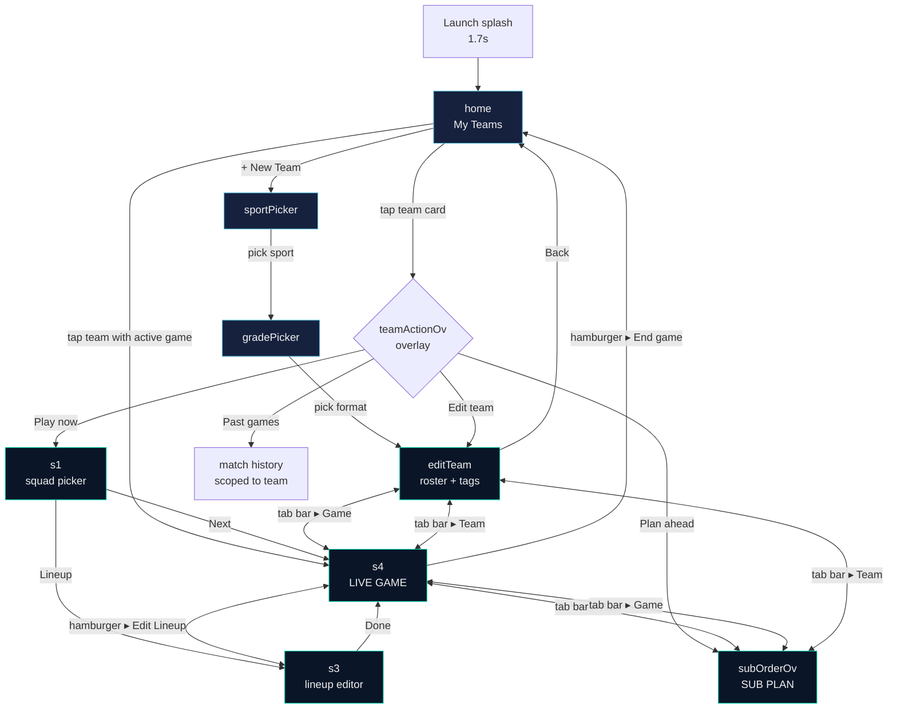

# Sub Timer — Architecture

> Companion to design.md. Documents how the app's screens flow into each other, where state lives, and which file holds what.

---

## 1. Single-file SPA

Everything ships in **`index.html`** — HTML, CSS, JS, embedded SVG icons, all inline. No build step; deployed straight to Vercel. The 7,500+ line file is organised as:

```
<head>
  <link rel="manifest">  ← PWA
  <style>                ← design tokens, anchors, components (~1000 lines)
</head>
<body>
  <div id="launchSplash">   ← fades after 1.7s
  <div class="app">
    <div id="home" class="scr active">     ← landing
    <div id="sportPicker" class="scr">     ← new-team sport choice
    <div id="gradePicker" class="scr">     ← new-team format choice
    <div id="editTeam" class="scr">        ← roster editor
    <div id="s1" class="scr">              ← squad picker (who's here today)
    <div id="s2" class="scr">              ← settings (legacy)
    <div id="s3" class="scr">              ← lineup editor (positions on field)
    <div id="s4" class="scr">              ← LIVE GAME
    <div id="subOrderOv" class="scr">      ← SUB PLAN
    [...overlays (.ov) for modals...]
  </div>
  <div id="appBrandBar">    ← persistent top anchor
  <div id="bottomTabBar">   ← persistent bottom anchor (hidden on landing)
  <script>                  ← state, render, navigation, 3D viewer (~6000 lines)
</body>
```

Only one `.scr` has `.active` at a time — they all share the same viewport.

---

## 2. Screen flow



### Navigation primitives

- **Bottom tab bar** — only visible once a team context is active. Three tabs: Game (s4) / Plan (subOrderOv) / Team (editTeam). Hidden on home / sportPicker / gradePicker.
- **Hamburger top-left** — appears on s4 and subOrderOv. Holds Edit Team / Settings / Back to game (Plan only) / Save plan + Edit Lineup (Plan CUSTOM only) / End game.
- **Top-right action** — used to be page-specific (Plan icon / Back). Tab bar now covers those routes.

---

## 3. State model

All client state. No backend except Supabase sync.

### 3.1 Persisted (localStorage)

| Key | Type | Notes |
|---|---|---|
| `subTimerTeams` | Team[] | The roster + prefs for every saved team |
| `subTimerActive` | { teamId, G, cfg, avail, ... } | The in-progress game, if any. Recovered on launch via the inline "Resume" affordance on the matching team card |
| `subTimerHist` | MatchRecord[] | Completed matches |
| `subTimerSoundPack` | string | Selected sound preset (classic / whistle / airhorn / ...) |
| `subTimerTipsDismissed` | "1" \| null | Whether the home tip carousel has been hidden |

### 3.2 Cloud sync (Supabase)

When a coach signs in (Settings ▸ Sign in), each `Team` and `MatchRecord` mirrors to a Supabase table keyed by `user_id`. Pull-down-to-refresh and "Sync now" buttons trigger reconciliation. Conflict resolution is last-write-wins.

### 3.3 In-memory (resets on reload unless saved)

| Variable | Purpose |
|---|---|
| `teams` | Loaded copy of subTimerTeams |
| `currentTeam` | The team the coach is currently working with |
| `editingTeam` | Mutable copy used by editTeam screen; merged back on Save |
| `G` | Game state — `{half, secs, running, on, bench, pt, sd, scoreUs, scoreThem, log, ...}` |
| `cfg` | Per-game config — `{hm, sf, sc, subStrategy, subPlan, breaksOnly, ...}` |
| `avail` | Players selected for THIS game (array of names) |
| `luOrd` | Lineup order — first N play, rest start on bench |
| `gk1`, `gk2` | GK index per half |
| `rotPairs` | Matched-strategy pair list |
| `_planTimeline`, `_planScrubIdx` | Plan-page scrub state |
| `_subOrderStrat` | Plan-page AUTO/CUSTOM toggle |
| `gameMode`, `fieldSwapSel`, `injuryOffSel` | Field-pill gesture armed state |

---

## 4. Module map (within index.html)

Approximate line ranges:

| Lines | Section | Notes |
|---|---|---|
| 1-160 | `<head>` + CSS tokens | Design tokens, anchors, .scr / .hdr / .gd-btn / .tmr-c / .fc, landscape media queries |
| 200-510 | Splash + .ov modal CSS | Launch animation, overlay base |
| 522-1160 | Screen HTML | All 9 `.scr` containers + every overlay |
| 1163-1450 | Constants + persistence | SPORTS / FORMATS / FORMATIONS / DIMS, loadTeams / saveTeams / loadActiveGame |
| 1450-1900 | Sport metadata | SPORTS object, FORMATS table, FORMATIONS table |
| 1900-2150 | Game logic | quickStart / startGame / trigSub / pickSubStrategy / nxtST |
| 2200-2750 | **3D pitch viewer (afl3d)** | Three.js renderer, setView, buildSoccer / buildAfl / buildNetball / buildBasketball, pill projection, sub-swap tween |
| 2800-3000 | Screen navigation | showScr, renderViewSwitcher, switchToView |
| 3000-3700 | Home + tips + quote | renderHome, HOME_TIPS, COACH_QUOTES, openTeamActions, teamActionPlayNow / PlanAhead / PastGames / Edit |
| 3700-4500 | Team editor | editTeamScreen, renderRoster, saveAndBack, photo-upload OCR |
| 4500-5500 | Game screen render | renderG, renderBenchInto, renderScore, renderGameDash, gameMenu |
| 5500-6500 | 2D pitch fallback | Used when Three.js isn't available |
| 6500-7400 | Plan page | openSubOrder, renderPlanRosterOverview, renderPlanClockAnchor, renderPlanControlBand, buildPlanTimeline, computeProjectedMinutes, renderPlanProjectedMinutes |
| 7400-7700 | Misc | Sound packs, what's new modal, version stamp, init at bottom |

---

## 5. Lifecycle of a game

```
Coach taps team card
  └─ openTeamActions(teamId)
     └─ teamActionPlayNow → selectTeam → s1 squad picker
        └─ startFromSquad → quickStart → startGame
           ├─ Creates G object (half:1, secs:0, on:[...], bench:[...], log:[{sub_strategy}])
           ├─ snapshotHalfStart() — for RESET-to-kickoff
           ├─ saveActiveGame() — persists immediately
           └─ renderG() + showScr('s4')

Live (tickLoop runs while G.running):
  ├─ G.secs++ per second, accrue G.pt[name]++ for each on-field player
  ├─ At sub time (nxtST() returns G.secs) → trigSub()
  │   ├─ For fair/paired strategies: auto-fire confSub() after picking off/on
  │   └─ For planned: only fires if the plan has an event at this time
  ├─ Tap on field pill → fieldPillClick → swap selection
  ├─ Long-press field pill → injury mode → wait for bench tap → injurySwap
  ├─ Score buttons → G.scoreUs / G.scoreThem ++ → G.log += goal event
  ├─ Period end → advH() → break overlay → startNextPeriod()
  └─ Final period end → game-over flow → archived to subTimerHist + cleared from subTimerActive

Resume:
  loadActiveGame() at boot → resumeActiveGame() restores G/cfg/avail
```

---

## 6. Sport polymorphism

Each sport plugs into the same shell. The differences are isolated to:

- `SPORTS[key]` — periods, period labels, position tag list, ball icon
- `FORMATS[key]` — on-field count, GK flag, default times, default formation
- `FORMATIONS[fmtKey][formationName]` — position list with normalised x,y
- `afl3d.DIMS[sport]` — field dimensions + shape + goal height
- `afl3d._build<Sport>()` — Three.js scene construction
- `getSport(team).periodShort(p)` — period label per sport
- `renderScore()` — AFL has goals + behinds; others just a single number

Sub-timer logic itself (`trigSub`, `nxtST`, `pickSubStrategy`, sub plan replay) is sport-agnostic.

**Adding a new sport** (e.g., water polo):
1. Add entry to `SPORTS`
2. Add format(s) to `FORMATS`
3. Add formation(s) to `FORMATIONS`
4. Add `DIMS[sport]`
5. Add `_build<Sport>()` method on `afl3d`
6. Add the sport key to the `_use3d` allowlist in both renderG + renderPlanField3D
7. Add ball icon SVG to the tab-bar switcher
8. Add position labels to `posLabel` regex if non-trivial

---

## 7. Plan page sub-state

The Plan page (subOrderOv) is the most complex screen. Its rendering pipeline:

```
openSubOrder()
  ├─ buildPlanTimeline() — simulates every sub event for the rest of the game
  │   └─ For AUTO: walks future sub times, picks off/on by playing-time order
  │       For CUSTOM: reads from cfg.subPlan.events
  │   Stores: { events:[{period, time, off, on, stateAfterOn, stateAfterBench, done}], initialOn, initialBench, periodCount }
  ├─ renderSubOrderTabs() — AUTO/CUSTOM segmented control
  ├─ renderSubOrderControls() — Players-per-sub stepper sync
  ├─ renderPlanRosterOverview() — field card with chips + 3D pitch
  │   └─ renderPlanFormationChips() + renderPlanField3D() + renderPlanBenchChips() + renderPlanScrubBar()
  │       └─ renderPlanScrubBar() = renderPlanClockAnchor() + renderPlanControlBand()
  ├─ renderPlanProjectedMinutes() — full-game minutes-per-player card
  ├─ renderSubOrder() — period-grouped sub timeline
  └─ showScr('subOrderOv') + start live-clock interval
```

Scrubbing forward (`planScrubStep(1)`):
- Increments `_planScrubIdx`
- `getPlanScrubState()` returns `{on, bench, time, period, idx, total, isLive}` for the scrubbed event
- Pitch + bench + clock anchor + sub timeline all re-paint to that state
- Tap interactions disabled when `idx > 0` (preview only)

---

## 8. The two anchors

```
┌──────────────────────────────────────────┐
│        #appBrandBar (34px + notch)       │  position:fixed top:0, z:9001
│        SUB TIMER · BETA · v2.7.81        │  Visible on EVERY page
└──────────────────────────────────────────┘
│                                          │
│           (active .scr content)          │
│                                          │
│  Page header (.hdr / custom toolbar)     │  84px min-height
│  Per-page body                           │  Scrollable
│                                          │
│  Per-page bottom band (gameDash /        │  flex-shrink:0
│  planControlBand) — game + plan only     │
│                                          │
├──────────────────────────────────────────┤
│  #bottomTabBar (58px + home indicator)   │  position:fixed bottom:0, z:9000
│        Game     Plan     Team            │  Hidden on landing pages
└──────────────────────────────────────────┘
```

---

## 9. References

- design.md — visual specs (tokens, components, patterns)
- CHANGELOG.md — version history
- AFL-MODE-SPEC.md — early notes on the AFL adaptation
- README.md — public README
