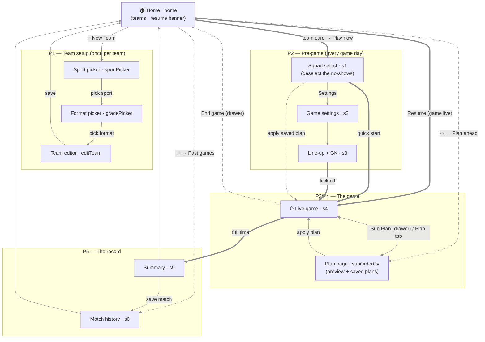
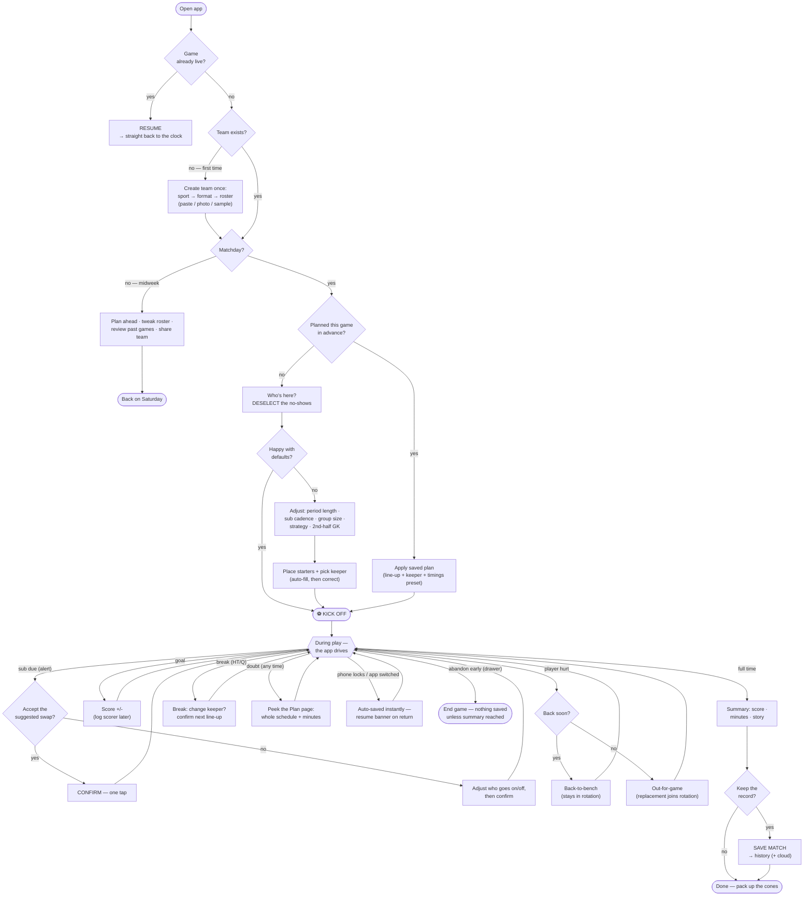
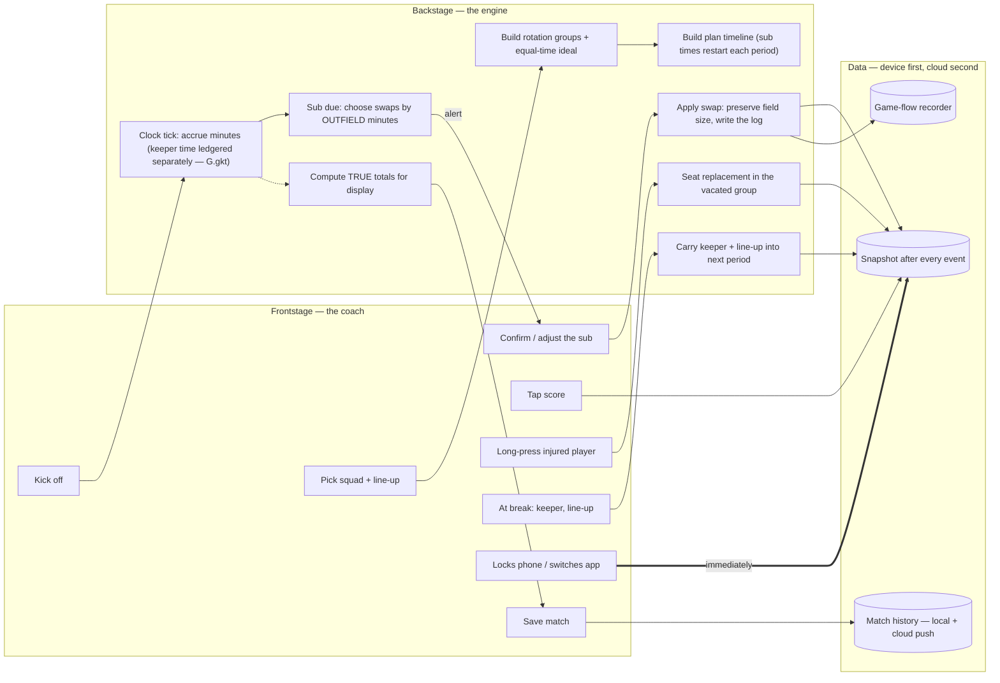

# Sub Timer — Screen Flow

> The map of screens and the routes between them. Screens are `showScr`
> targets (ids match `UIMAP.md` and `SCREEN-BRIEFS.md`); edges are the
> journeys from `UX-PATHWAYS.md`. The drawer overlays every screen.

**Reading it:** bold edges (⇒) are the Saturday path — Home → squad →
kick off → full time → save. Thin edges are setup and detours; dotted are
menu routes. The Live game ⇄ Plan page pair is the app's working core: the
same game seen as "now" and as "the whole schedule".

_Not drawn: the drawer (overlays every screen — see `SCREEN-BRIEFS.md`
`drawer`), modals (feedback, share, sound picker, what's-new), and the dev
panel (`?dev=1`)._

---

## The coach's workflow tree (user flow, decision-first)

The same app from the coach's side: what they're deciding, not what screen
they're on. This is the tree the cognitive-load budgets protect — every
diamond is a decision the UI must make obvious.

> **Stamped by the owner 2026-08-08** (v2 — entry is a neutral "Open app";
> matchday is a branch, not a premise; midweek intents drawn explicitly).
>
> **v3 (rehearsal decisions, same day — FigJam board has the full redraw):**
> the two branches ARE the app's two modes — **PLAY mode** (matchday: squad →
> review keeper/shape/positions + timing glance → ANNOUNCE → kick off; in-play
> relay cards; break ritual keeper→shape→positions→announce; full-time =
> confirm score + player of the match, enrichment deferred to the car park)
> and **PLAN mode** (midweek: create/edit teams, set the sub plan, review +
> opposition notes, share). Settings are seasonal. The Plan page does NOT
> live on the game view. See SCREEN-BRIEFS.md "The governing split".

**The shape to protect:** one decision per moment. Before the game the coach
answers at most four questions (who's here → defaults? → line-up → kick off);
during it the *app* raises the questions and the coach mostly answers yes.
Any redesign that adds a decision to the left half of a diamond is adding
cognitive load — check it against the choice budgets in `SCREEN-BRIEFS.md`.

**Environment states that shape every flow** (not drawn as nodes — they are
ambient): offline at the ground (cold start works, 2D pitch fallback — v2.9.3),
one-handed use, sunlight. Design against these on every screen, not per-flow.

---

## Service blueprint — what the engine does beneath each coach action

The backstage lane. Frontstage is the coach; backstage is the rotation and
persistence machinery; the data lane is device-first, cloud-second.

The blueprint's design rule: **every arrow from frontstage to backstage is a
decision the coach was spared.** When considering a new feature, first ask
which lane it belongs in — most good Sub Timer features are backstage.

---

_Status: descriptive, not yet enforced — by CONTROL-DOCS' own rule this file
is currently a description. Candidate check: every screen-map edge must
correspond to a `showScr` route in UIMAP (a small `flow-check`). Until then,
treat divergence between this file and UIMAP as a bug in this file._
